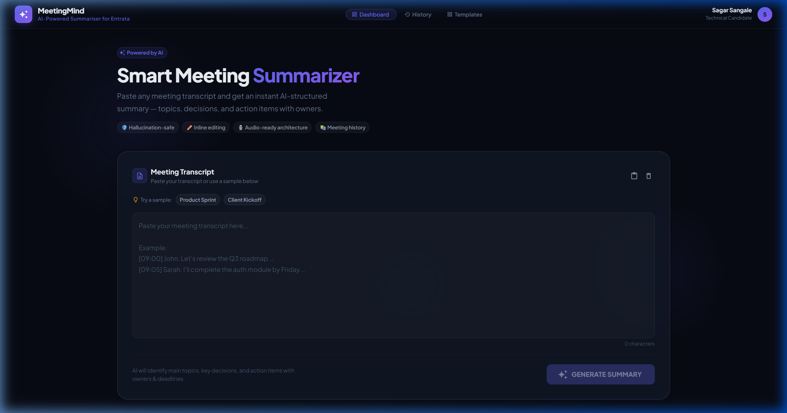
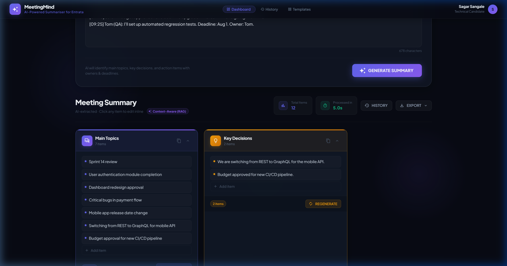
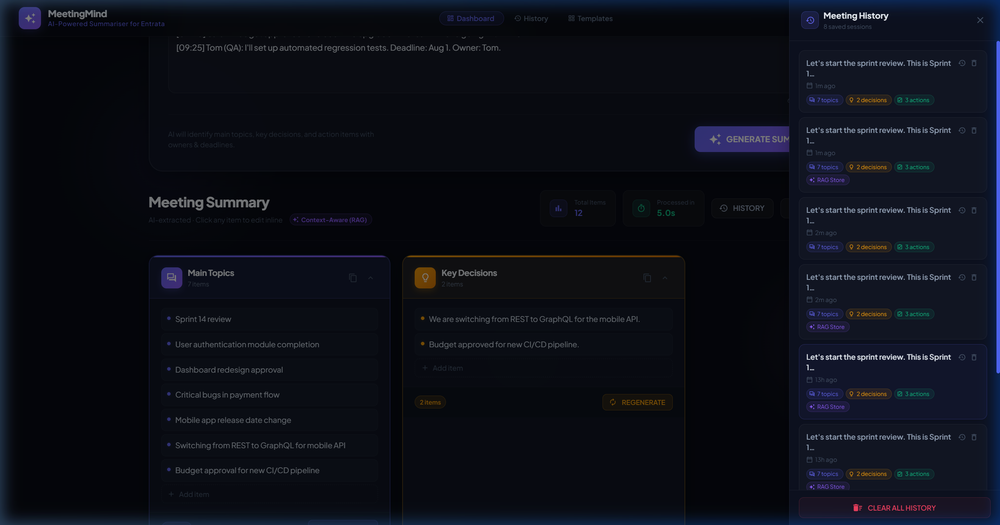
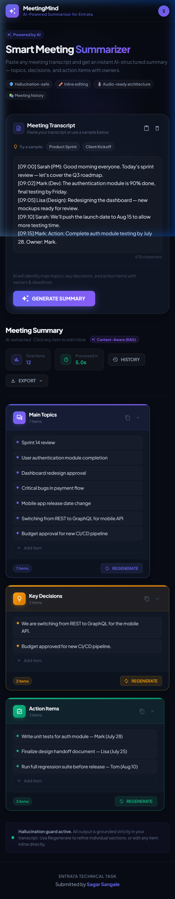
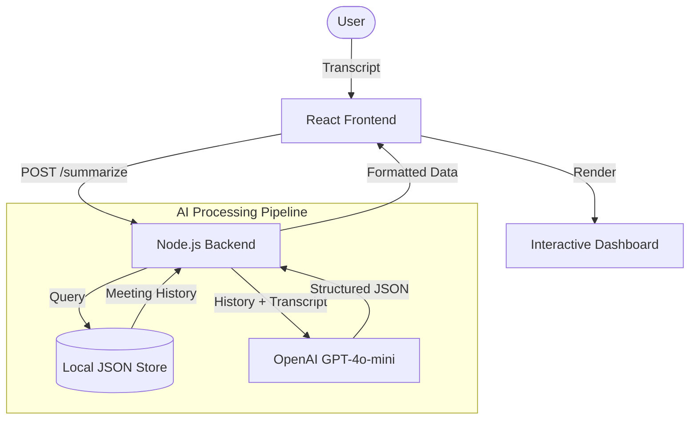

# 🎙️ Smart Meeting Summarizer

**A Production-Ready AI Dashboard for Actionable Meeting Intelligence**

[](https://reactjs.org/)
[](https://nodejs.org/)
[](https://openai.com/)
[](https://mui.com/)
[](https://aws.amazon.com/)

---

## 🌟 Overview

The **Smart Meeting Summarizer** is a high-performance, full-stack application designed to convert raw meeting transcripts into structured, actionable intelligence. Leveraging modern AI and a **Retrieval-Augmented Generation (RAG)** approach, it doesn't just summarize; it provides contextually aware insights while maintaining continuity across multiple sessions.

Built with a "Cloud-First" mindset, this project demonstrates professional engineering practices in AI integration, responsive UI design, and scalable cloud architecture.

---

## 🖼️ Visual Experience

| **Dashboard Overview** | **AI-Generated Summary** |
|:---:|:---:|
|  |  |
| **Meeting History** | **Mobile Optimization** |
|  |  |

---

## 🚀 Key Features

-   **🧠 Context-Aware AI**: Implements a lightweight RAG system that uses past meeting history to provide deeper context in current summaries (e.g., tracking project names or recurring tasks).
-   **⚡ Structured Intelligence**: Automatically extracts **Key Topics**, **Strategic Decisions**, and **Action Items** with assigned priorities.
-   **🔄 Section Regeneration**: Granular control to re-generate specific summary sections without wasting tokens on the entire transcript.
-   **✍️ Interactive Editing**: AI-generated items are clickable and editable, allowing for human-in-the-loop accuracy.
-   **📱 Premium UI/UX**: A glassmorphism-inspired dark mode dashboard built with Material UI, optimized for high readability and mobile responsiveness.
-   **🛡️ Hallucination Guard**: Configured with low-temperature LLM settings (0.1) for factually grounded and reliable summaries.

---

## 🏗️ System Architecture

The application follows a modular **Client-Server Architecture** optimized for asynchronous AI processing.



### Technical Workflow:
1.  **Input Processing**: The raw transcript is sanitized and prepared for context injection.
2.  **Context Injection (RAG)**: The backend pulls relevant snippets from previous meetings to ground the AI's response.
3.  **LLM Orchestration**: A strictly formatted prompt is sent to `gpt-4o-mini` to ensure a consistent JSON structure.
4.  **UI Hydration**: The frontend dynamically renders the JSON into interactive components.

---

## 🛠️ Technology Stack

### **Frontend**
- **Core**: React.js 18 (Hooks, Context API)
- **Styling**: Material UI (MUI) with custom HSL color palettes
- **API Client**: Axios with interceptors for reliable communication

### **Backend**
- **Runtime**: Node.js & Express
- **AI Engine**: OpenAI SDK (`gpt-4o-mini`)
- **Persistence**: File-based JSON storage (optimized for demonstration; designed for DynamoDB migration)

---

## ☁️ Cloud & DevOps Readiness

This project is architected for a modern **AWS Ecosystem**:

-   **Hosting**: React Frontend on **Amazon S3** + **CloudFront**.
-   **Compute**: Node.js Backend on **AWS EC2** (managed via PM2).
-   **Security**: API Keys managed through **AWS Secrets Manager**.
-   **CI/CD**: Fully compatible with **AWS CodePipeline** for automated builds and blue/green deployments.

> [!TIP]
> View the [**Full AWS Deployment Guide**](./doc/AWS_DEPLOYMENT.md) for a deep dive into the infrastructure.

---

## 🏁 Getting Started

### 1. Prerequisites
- **Node.js** (v16.0.0 or higher)
- **OpenAI API Key**

### 2. Installation
```bash
# Clone the repository
git clone https://github.com/yourusername/smart-meeting-summary.git

# Install dependencies
cd frontend && npm install
cd ../backend && npm install
```

### 3. Environment Configuration
Create a `.env` file in the **backend** directory:
```env
PORT=5000
OPENAI_API_KEY=your_key_here
```

Create a `.env` file in the **frontend** directory:
```env
REACT_APP_API_URL=http://localhost:5000/api
```

### 4. Running Locally
```bash
# Start Backend (Port 5000)
cd backend && npm start

# Start Frontend (Port 3000)
cd frontend && npm start
```

---

## 📖 Extended Documentation
- 📂 [Project Overview](./doc/PROJECT_OVERVIEW.md)
- 📂 [Key Features Details](./doc/KEY_FEATURES.md)
- 📂 [Technology Stack](./doc/TECHNOLOGY_STACK.md)
- 📂 [Project Structure](./doc/PROJECT_STRUCTURE.md)
- 📂 [System Architecture](./doc/ARCHITECTURE.md)
- 📂 [AI Strategy & Prompt Engineering](./doc/AI_STRATEGY.md)
- 📂 [AWS Deployment Walkthrough](./doc/AWS_DEPLOYMENT.md)

---

**Submitted by Sagar Sangale**  
*Full-Stack Developer | AI Enthusiast | Cloud Architect*

