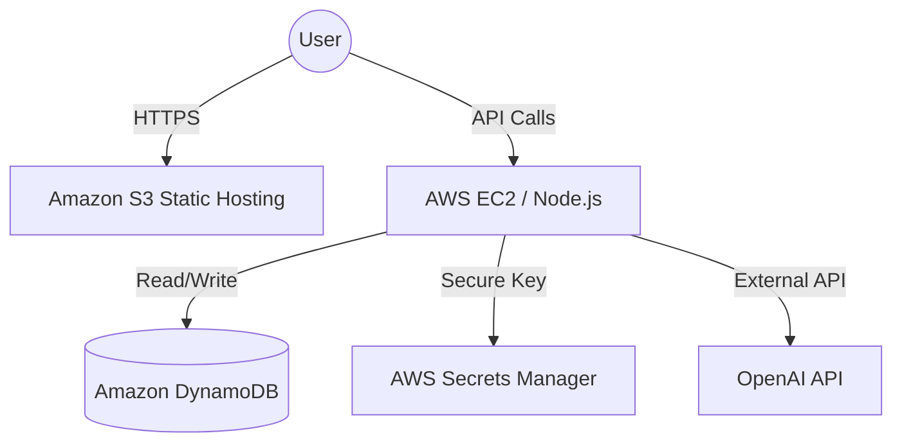

# 🌍 AWS Cloud Deployment Architecture

This document outlines the professional deployment strategy for the **Smart Meeting Summarizer** on Amazon Web Services (AWS), demonstrating a scalable, secure, and cost-effective cloud architecture.

---

## 🏗️ Proposed AWS Architecture

To move from a local development environment to a production-ready cloud system, the following AWS services are utilized:

### 1. Frontend Hosting (Highly Available)
- **Amazon S3**: The React application is built into static assets (`npm run build`) and hosted in a publicly accessible S3 bucket with "Static website hosting" enabled.

### 2. Backend API (Scalable & Secure)
- **AWS EC2 (Elastic Compute Cloud)**: Hosts the Node.js/Express backend on a virtual server instance. This allows for full control over the operating system and custom server tuning.
- **Process Management**: Uses **PM2** on the EC2 instance to ensure the Node.js process stays alive even after session logout.

---

## 📊 Architecture Diagram (Conceptual)

## 🚀 Deployment Steps (Brief)
1. **Frontend**: Run `npm run build` and upload the `build/` folder to an S3 bucket with "Static website hosting" enabled.
2. **Backend**: Provision an AWS EC2 instance (e.g., t3.micro), install Node.js/NPM, clone the repo, and run the server using **PM2**.
3. **Database**: Create a DynamoDB table with `userId` as the Partition Key and `meetingId` as the Sort Key.
4. **Secrets**: Update the backend to fetch the `OPENAI_API_KEY` from AWS Secrets Manager or export it as an environment variable on the EC2 instance.

---
**Submitted by:** Sagar Sangale  
**Goal:** To demonstrate production-grade cloud infrastructure knowledge.
